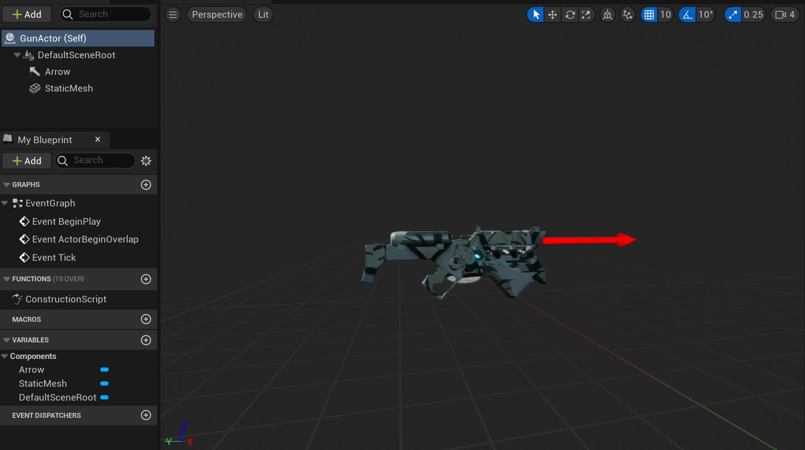
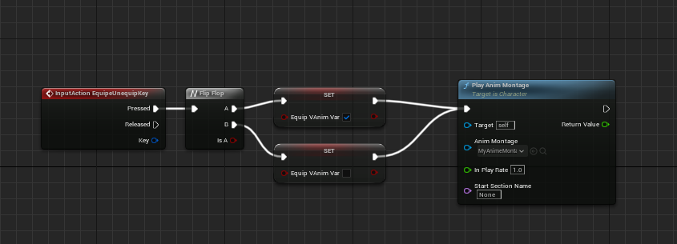
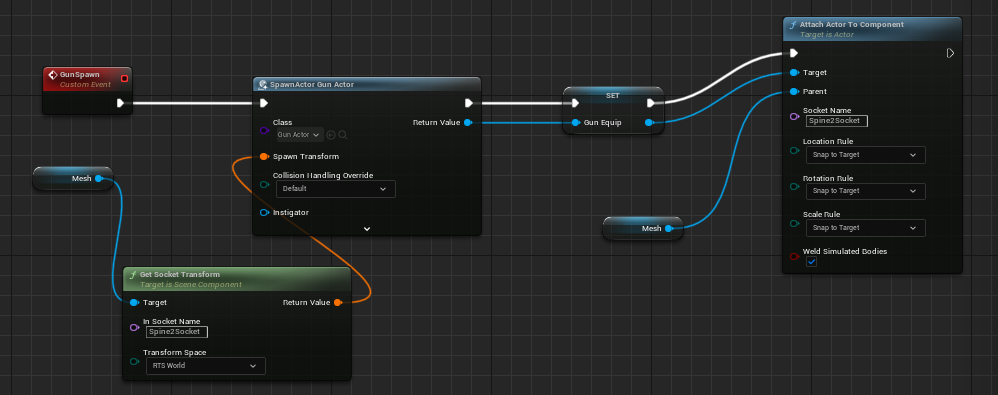

# Attach-Rifle-with-character-mesh-and-bullet-spawn-from-Rifle-

## Aim:
To Attach Rifle with character mesh and implementation bullet spawn from Rifle 

## Algorithm:
### Step-1:
Import the character mesh and rifle model into your game engine or development environment. Ensure that both assets are properly rigged and prepared for animation.
### Step-2:
Create an attachment point on the character's hand or shoulder where the rifle will be attached. This can be achieved by adding a socket or bone to the character's skeleton.
### Step-3:
Attach the rifle model to the character's attachment point using the appropriate parenting or socketing mechanism provided by your game engine. This will ensure that the rifle follows the character's movements and animations correctly.
### Step-4:
Implement the logic for bullet spawning. You'll need to determine the position and direction from which the bullets should be spawned based on the rifle's barrel. Usually, this involves creating a spawn point on the rifle model, such as the barrel tip.
### Step-5:
When the player triggers the shooting action (e.g., pressing a button or clicking the mouse), instantiate a bullet object at the spawn point you determined in the previous step. The bullet object should have its own movement and collision logic.
### Step-6:
Set the initial velocity and direction of the bullet based on the rifle's orientation and any additional factors you want to consider, such as recoil or spread.
### Step-7:
Continue updating the bullet's position and check for collisions or other interactions until it reaches its target or goes out of bounds. Handle any necessary effects or damage calculations upon collision.
### Step-8:
Repeat the bullet spawning process as needed whenever the player triggers the shooting action.

## To implement the score widget:
### Step-1:
Create a score variable: Declare a variable to keep track of the player's score. For example, you can initialize it to zero at the beginning of the game.
### Step-2:
Detect bullet-object collision: Implement a collision detection system to detect when a bullet collides with an object. This can vary depending on the game engine or framework you are using. Typically, you would check for collisions between the bullet and the object using their respective collision shapes or bounding boxes.
### Step-3:
Handle collision events: When a collision between a bullet and an object is detected, trigger a collision event or callback function. This function will be responsible for handling the specific actions associated with the collision.
### Step-4:
Increase the score: Inside the collision event function, increment the score variable by a certain amount. For example, you can add one point to the score every time a bullet hits an object.
### Step-5:
Update the score widget: After increasing the score, update the score widget to display the updated score value. This can be done by accessing the score widget element or object and setting its text or value to the updated score variable.
### Step-6:
Display the score widget: Ensure that the score widget is visible to the player during gameplay. This might involve placing it in a prominent position on the screen or integrating it into the game's user interface (UI) system.
### Step-7:
Repeat the process: Repeat steps 2 to 6 for each object that the player can interact with or shoot at. Whenever a bullet collides with an object, increase the score and update the score widget accordingly.
### Step-8:
Optional: Add visual and audio feedback: To enhance the player's experience, you can consider adding visual and audio feedback when a bullet hits an object. For example, you might display a particle effect or play a sound effect to signify a successful hit.

## Output:
### GUN:

### GunActor:

### BulletActor:

### BluePrints for gun spawn and bullet spawn:

### Gun in Hand:

## Result:
To Attach Rifle with character mesh and implementation bullet spawn from Rifle is implemented successfully.